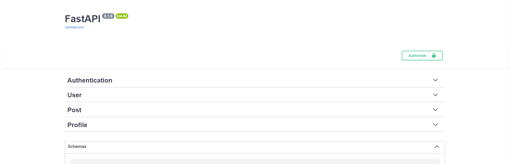

# SpaceBox - Space for everyone

This is the live demo for [SpaceBox](https://spacebox-j177.onrender.com/).

## Overview

Space Box is a Social Media platform based application for user to
share daily feeds of personal or social life.\
The apps that lets you Create, Update Delete your daily post
which can be images or videos.
The images and videos are hosted on cloud storage
Here any user can like any posts and can Follow any users.\
User suggestion will be there based on the unfollowed list of users on platform.
User can also update his/her profile such as BIO, Location and others.\
Since on Feed/Home page images and videos are getting loaded so implemented 
pagination to reduce page load, data and improve the performance.

<br>

## Key Features
- Social Media platform to share daily feeds 
- Apps that lets you Create, Update Delete your daily post
- The images and videos are hosted on cloud storage
- Like any posts and can Follow any users.
- User suggestion based on the unfollowed list of users
- Pagination to reduce page load improve the performance.

<br>

## Run Locally

Clone the project

```bash
  git clone https://github.com/ShaikhKhizar451/Space_Box
```

Create virtual environment

```bash
  virtualenv env-name
```

Install all the dependencies

```bash
  pip install -r requirements.txt
```
Run Server

```bash
  uvicorn main:app --reload
```
Access API locally with url

```bash
  https://localhost:port/docs
```
<br>
<!-- Add image in a directory and link -->


<br>

## Tech Stack
**Server:**


**Database:**


**Client:** 


<br>


<hr>
<!-- Add image in a directory and link -->

<hr>

<br>

## 🚀 About Me
Hello **Khizar** here👋, Qualified and professional **Web Developer** with close to **2 years** of experience in UI development. Currently focused on Full Stack Development with **Python**👨‍💻.

<br>

## 🛠 Skills


<br>


## 🔗 Links
[](https://github.com/ShaikhKhizar451)
[](https://www.linkedin.com/in/khizar-shaikh-58190b10b/)
